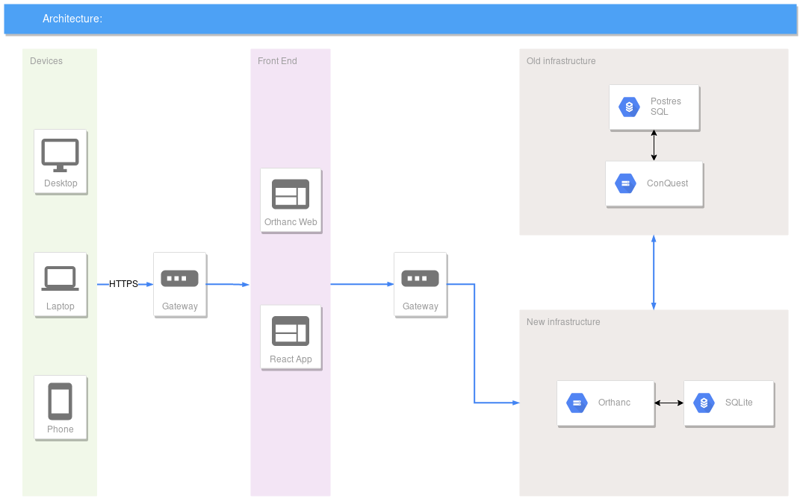

# Dokumentacja infrastruktury PACS  DICOMWeb
W ramach projektu stworzona została nastepująca architektura:

## Conquest

Aby zasymulować rozbudowę istniejącej architektury PACS wykorzystaliśmy oprogramowanie [Conquest](https://ingenium.home.xs4all.nl/dicom.html) wraz z bazą danych PostrgreSQL.

Stworzony został specjalny obraz kontenera Docker zapewniający automatyczną jego instalację oraz konfiguracja całego środowiska z użyciem narzędzia Docker compose. Całość została wdrożona na instancji maszyny wirtualnej Azure.

## Orthanc

Na drugiej maszynie wirutalnej skonfigurowany został, również z pomocą Docker Compose, zestaw współdziałających ze sobą kontenerów:

* Serwer Orthanc
* Serwer autoryzacji - aplikacja Node.js zarzadzająca autoryzacją wykonania poszczególnych żądań HTTP
* Simple Web Client - przykładowy klient webowy napisany w technologii React korzystający z API udostępnianego przez serwer Orthanc 
* nginx proxy - serwer agregujący wszystkie wymienione usługi pod jedną usługą HTTP wraz ze skonfigurowanym wydzielonym dostępem oraz przykładowym (samopodpisanym) certyfikatem SSL

"Nowy" serwer PACS

